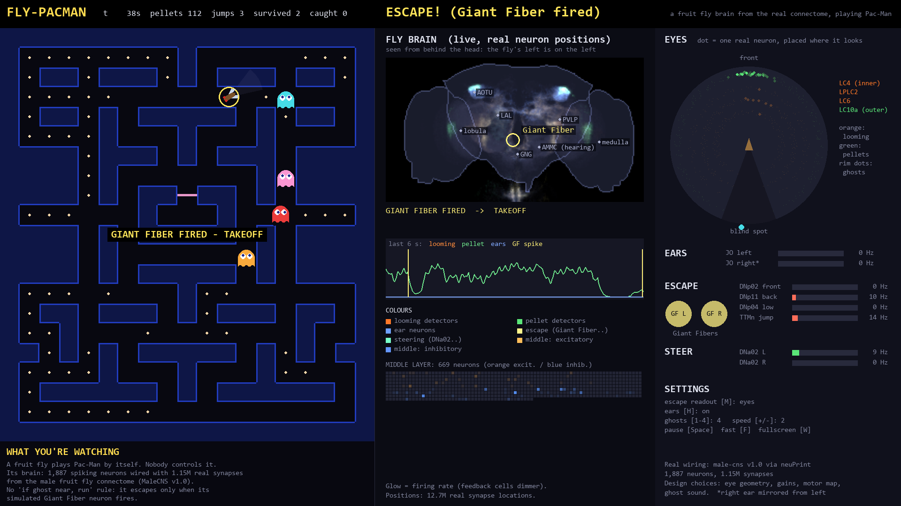

# Fly-Pacman 🪰

### A fruit fly plays Pac-Man by itself, using a brain built from a real fly's wiring diagram.



---

## What is this?

Normally *you* steer Pac-Man. Here **nobody steers**. The player is a **fruit fly**, and it moves on its own, driven by a **simulated brain**.

That brain isn't made up. Scientists took a real fruit fly, sliced its brain into thousands of ultra-thin layers, photographed each one with an electron microscope, and traced **every brain cell and every connection** between them. That map is called a **connectome**.

This project takes **1,887 brain cells** and the **1.15 million connections** between them from that real map, and runs them as a live computer simulation that plays the game.

> **Think of it like this:** someone gave you the complete wiring diagram of a real fly's brain. You rebuilt part of it on a computer, flipped the power on, and let it play Pac-Man.

---

## What does the fly do?

🟢 **It looks for pellets.** Brain cells that spot small objects (the same ones male flies use to chase females) notice pellets, and steering cells turn the fly toward them.

👻 **It escapes ghosts.** When a ghost rushes at the fly, it grows bigger and bigger in the fly's view. Special **"something is coming at me!"** brain cells fire, and they trigger the **Giant Fiber**, the fly's real emergency-jump neuron. It's the reason real flies are so hard to swat. The fly bolts.

🚫 **There is no "if a ghost is close, run away" rule in the code.** The fly only escapes if the electrical activity in its simulated brain actually builds up enough to fire the Giant Fiber. Sometimes it reacts in time, and sometimes it doesn't, just like a real fly.

🙈 **It has a blind spot.** Like real flies, it can't see directly behind itself, and the ghosts can sneak up from there.

---

## What you see on screen

| Part of the screen | What it shows | Think of it as |
|---|---|---|
| **Maze** (left) | the fly (brown, red eyes) playing against 4 ghosts | the game |
| **Fly brain** (middle) | the **real shape of a fly's brain**. Every simulated brain cell glows **at its true position** while it's active | a night-time photo of a city, where lit windows show who's awake |
| **Eyes** (right) | a radar centred on the fly. Each dot is one real vision cell, placed in the direction it looks. Orange = "something's coming", green = "pellet spotted" | a radar screen |
| **Escape** | the two Giant Fibers flash yellow when they fire, and the fly jumps | the fire alarm |
| **Steer** | left vs right steering cells; the stronger one wins | two people pulling a steering wheel |
| **Last 6 s** | a scrolling line of brain activity | a heart monitor |

**Watch for this:** a ghost charges → orange dots light up on the eye radar → the fly's brain glows → the Giant Fiber flashes → the fly escapes.

---

## Try it yourself

You need **Python 3.10 or newer** ([download it here](https://www.python.org/downloads/)). Then, in a terminal:

**1. Download the project**
```bash
git clone https://github.com/rev4n7/fly-pacman.git
cd fly-pacman
```
(Or click the green **Code** button on this page → **Download ZIP** → unzip it, then open a terminal in that folder.)

**2. Install what it needs** (one time only)
```bash
python -m venv .venv
.venv\Scripts\activate
pip install -r requirements.txt
```
*On Mac or Linux, use `source .venv/bin/activate` instead of the second line.*

**3. Start it**
```bash
python -m flypac.game
```

A window opens and the fly starts playing. The brain data is already included, so **you don't need any account**.

**Controls:** `Space` pause · `F` fast-forward · `W` fullscreen · `+` / `-` faster / slower ghosts · `1`–`4` number of ghosts · `R` restart · `Esc` quit

---

## What's real and what isn't

Being honest about this matters.

✅ **Real (from the fly's brain map)**
- which brain cells exist, and what type each one is
- every connection between them, and how many contact points each connection has
- whether each cell excites or calms its neighbours (predicted from the microscope images)
- where each cell physically sits in the brain, and which direction each vision cell looks
- the brain's 3D shape

🔧 **My design choices**
- how strongly a ghost or pellet "switches on" the vision and hearing cells
- how the brain's output turns into moves in the maze
- the ghosts, the maze, and the ghosts' "sound"
- how the glowing brain picture is coloured

⚠️ **Limitations**
- **It's only part of a brain:** about 1,900 of the fly's ~167,000 brain cells.
- **Each connection is simplified:** counting contact points doesn't give their exact strength.
- **Some wiring is invisible:** a few connections, including the Giant Fiber's link to the jump muscle, are electrical and too small to see in the images.
- **The right ear is copied:** it's a mirror of the left ear, which was traced better.
- **Front vs back is read one step earlier:** the escape cells barely encode whether a threat is in front or behind, so by default the fly reads that from its vision cells instead.

---

## Want the full story?

📖 **[DEBRIEF.md](DEBRIEF.md)** explains the whole project from scratch: what a neuron is, how the simulation works, every decision, and every bug found and fixed along the way.

📓 **[scoping/SCOPING.md](scoping/SCOPING.md)** is the lab notebook written during the build.

<details>
<summary><b>For the technically curious</b></summary>

- **Data:** queried from the MaleCNS v1.0 connectome with `neuprint-python` (`flypac/fetch.py`, `flypac/fetch_anatomy.py`).
  - Circuit: looming (LC4, LPLC2, LC6) → Giant Fiber (DNp01) and escape descending neurons; pursuit LC10a → AOTU → DNa02; Johnston's-organ hearing.
  - Middle and feedback neurons are selected by synapse-count thresholds, not hand-picked.
  - Retinotopy: from each neuron's lobula dendrite centroid, referenced to Tm1 columns.
- **Neurons:** leaky integrate-and-fire, 0.1 ms steps (`flypac/brain.py`).
  - Weight = synapse count × 0.275 mV × sign, where the sign comes from the predicted neurotransmitter (ACh +, GABA/Glu −).
  - Constants from Shiu et al. 2024.
- **Game and display:** `flypac/world.py`, `flypac/maze.py`, `flypac/game.py`, `flypac/brainview.py` (pygame).
- **Regenerating the data** requires a free [neuPrint](https://neuprint.janelia.org) token in a `.env` file (`NEUPRINT_APPLICATION_CREDENTIALS=...`), then:
  - `python -m flypac.fetch`
  - `python -m flypac.fetch_anatomy`

</details>

---

## Credits

- **The fly brain map:** the FlyEM **Male CNS connectome** by Janelia Research Campus, the Cambridge Drosophila Connectomics Group and Google Connectomics, shared under **[CC-BY 4.0](https://creativecommons.org/licenses/by/4.0/)**.
  - The files in `data/` are derived from it.
  - Dataset paper: [bioRxiv 10.1101/2025.10.09.680999](https://www.biorxiv.org/content/10.1101/2025.10.09.680999v2) / *Cell* (2026).
- **neuPrint** and **neuprint-python:** Janelia Research Campus.
- **Neuron model settings:** Shiu et al. (2024), *A Drosophila computational brain model reveals sensorimotor processing*, *Nature*.
- **How looming cells connect to escape cells:** Dombrovski et al. (2023), *Synaptic gradients transform object location to action*, *Nature*.
